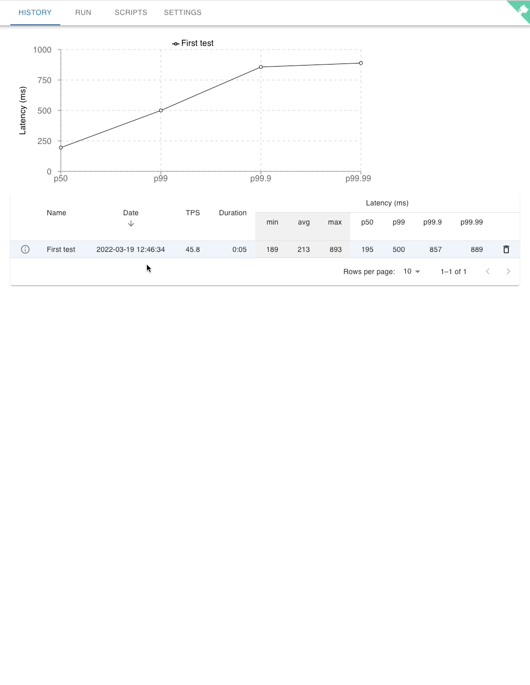

# latte
Latte is a simple fixed-throughput latency testing framework that embraces [open system model](https://www.usenix.org/legacy/event/nsdi06/tech/full_papers/schroeder/schroeder.pdf).
It is based on [k6](https://github.com/grafana/k6).


## Demo



## Installation
Download `docker-compose.yml` in the releases tab. The `docker-compose` version should be `>= 1.28`.
### Worker
```
$ docker-compose --profile worker up
```


### Controller
```
$ docker-compose --profile controller up
```
When the server is up, register the worker URL (`http://<worker addr>:8081`) and user info.


## Usage
1. Configuration
    
    A worker should be configured to run a test.
    Register or update the worker in the `SETTINGS` tab (skip if configured properly during installation).

2. Writing a test script

    Latte uses k6 internally, so you need to write k6 scripts for testing.
    The scripts are maintained in the controller and are accessible through git (please check `SCRIPTS` tab on the web console).
    You can check `scripts/DemoTest.js` from the initial git repository to see how the script is written.
    Please refer to the [k6 scripting guide](https://k6.io/docs/getting-started/running-k6/) for more usage.

3. Running a test

    After writing a test script, you can run the test in the `RUN` tab.
    The output of the test, which is the k6 standard output, is displayed at the `RUN` tab.
    When the testing is done, the latency distribution of the test is recorded and provided through the `HISTORY` tab.
    For performance reasons, only a single test can be run at a time.
    

## Architecture
```
Controller node
├── latte-controller-gui: Frontend server
├── latte-controller-api: Backend server
└── latte-controller-git: HTTP git apache server

Worker node
└── latte-worker
```
Latte is composed of two nodes: controller and worker.

#### Controller
The system state is managed in the controller.
`latte-controller-api` maintains the history of previous tests, forwards requests to the worker and returns responses back to the frontend server.
It also caches the responses and they are streamed to any users that open the `RUN` tab. 


#### Worker
Worker is where the actual test is run. The standard output of the test is streamed back to the controller node.
Currently only _a single_ worker can be attached to controller.
